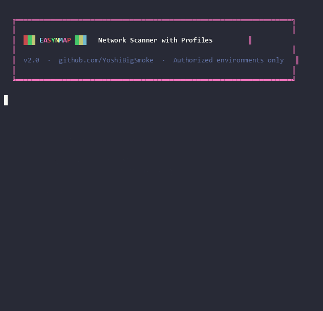

# EasyNmap

> Interactive nmap wrapper with device profiles, noise levels, and accurate OS detection. Plug-and-play — just run it and choose what to do.



---

## Features

- **8 device profiles** — Mac/macOS, iPhone/iOS, Windows, Linux, Server, Android, IoT, Generic. Each pre-loads the most relevant ports.
- **Apple-first** — dedicated Mac profile with AFP (548), Bonjour/mDNS (5353), Apple Remote Desktop (3283), AirPlay (7000). Apple vendors highlighted in discovery output.
- **3 noise levels** — Silent (T2 + delay, SYN only), Normal (T3), Aggressive (T4 + version detection + OS + `--osscan-guess`).
- **Accurate OS detection** — Aggressive mode uses `-O --osscan-guess --version-intensity 6` for the most precise guess possible. Extra option adds it on top of any mode.
- **Apple fingerprint scripts** — `afp-info`, `mdns-dns-sd`, `smb-os-discovery` as a dedicated extra for Mac/iOS targets.
- **3 depth levels** — Fast (top 100), Standard (profile ports), Full (-p-).
- **Shows the exact nmap command** before running — you learn what each combination does.
- **Network discovery** — ARP ping scan lists all live hosts with hostname and vendor before you pick a target.

---

## Requirements

- `nmap`
- `bash` >= 4.0
- `sudo` / root (required for SYN scan `-sS` and ARP ping `-PR`)

```bash
# Arch Linux
sudo pacman -S nmap

# Debian / Ubuntu
sudo apt install nmap
```

---

## Install

```bash
git clone https://github.com/YoshiBigSmoke/NetMapper.git
cd NetMapper
chmod +x easynmap.sh
```

---

## Usage

```bash
sudo bash easynmap.sh
```

Fully interactive — run and follow the menus.

---

## Menu flow

```
TARGET       →  scan /24 network (pick from list)  or  manual IP/hostname
DEVICE TYPE  →  select profile (sets default ports for Standard depth)
NOISE LEVEL  →  Silent / Normal / Aggressive
SCAN DEPTH   →  Fast (top 100) / Standard (profile ports) / Full (all 65535)
EXTRAS       →  -sV  -sC  -O --osscan-guess  --script vuln  Apple fingerprint
SUMMARY      →  review exact nmap command → confirm → execute
```

---

## Device profiles

| # | Profile | Standard ports | Recommended scripts |
|---|---|---|---|
| 1 | **Mac / macOS** | 22, 88, 389, 445, **548**, 3283, 5009, **5353**, 7000 | `afp-info`, `smb-os-discovery`, `mdns-dns-sd` |
| 2 | iPhone / iOS | 22, 80, 443, 5000, 7000, **62078** | `mdns-dns-sd` |
| 3 | PC Windows | 80, 135, 139, **445**, 1433, **3389**, 5985, 5986 | `smb-os-discovery`, `smb-vuln-ms17-010` |
| 4 | PC Linux | 22, 80, 111, 443, 631, 2049, 3306, 5432, 5900 | `ssh-hostkey`, `banner` |
| 5 | Server | 21, 22, 25, 53, 80, 443, 3306, 5432, 6379, 9200, 27017 | `banner`, `http-title`, `ssh-hostkey` |
| 6 | Android | **5555**, 5037, 8080, 8443 | `banner` |
| 7 | IoT / Embedded | **23**, 80, 443, **554**, **1883**, 1900, 5683, 8883 | `banner` |
| 8 | Generic | nmap top 1000 | — |

---

## Noise levels

| Level | nmap flags | Use when |
|---|---|---|
| **Silent** | `-sS -T2 --max-retries 1 --scan-delay 200ms` | Avoiding IDS/IPS, low-traffic environments |
| **Normal** | `-sS -T3 --min-rate 300` | Everyday scanning |
| **Aggressive** | `-sS -sV --version-intensity 6 -O --osscan-guess -T4 --min-rate 1000` | Maximum info, speed over stealth |

---

## File structure

```
NetMapper/
├── easynmap.sh          ← entry point
├── easyN.sh             ← legacy alias (redirects to easynmap.sh)
└── modules/
    ├── discovery.sh     ← ARP ping scan, host table
    ├── profiles.sh      ← device profiles (ports + NSE scripts)
    └── stealth.sh       ← noise levels (timing + technique)
```

---

## Legal

For use only on networks and devices you own or have explicit written authorization to test. Unauthorized scanning is illegal. The author assumes no responsibility for misuse.
